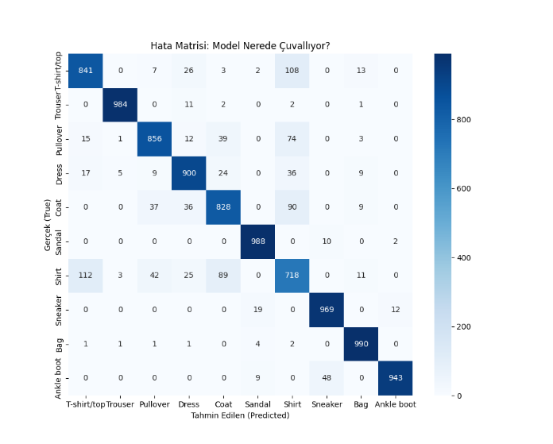
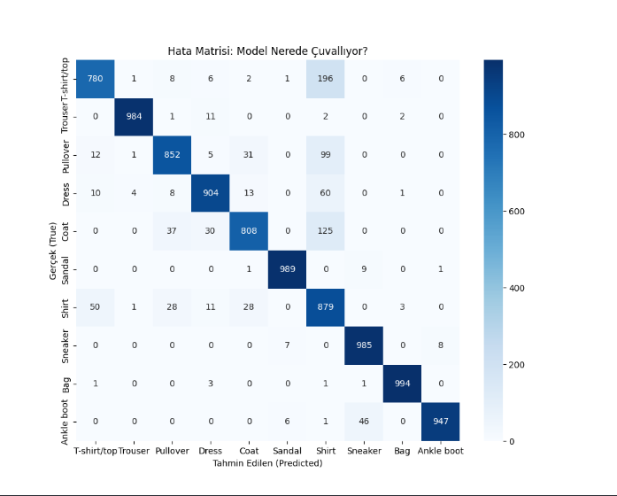
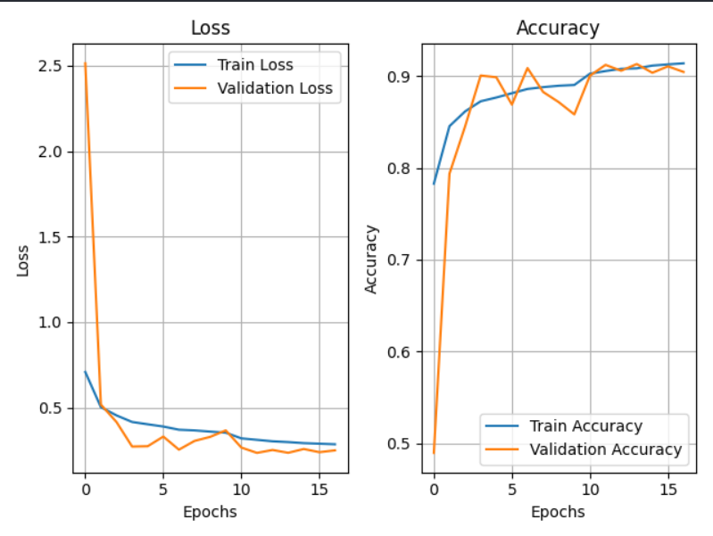

# 👔 Solving Class Imbalance in Fashion MNIST with Weighted CNN


## 📖 Executive Summary

This project addresses the **"Shirt vs. T-shirt" misclassification problem** commonly observed in standard CNN architectures trained on the **Fashion MNIST** dataset.

While baseline models often achieve high overall accuracy (~92%), they fail significantly in recognizing the **Shirt (Class 6)** category due to its structural similarity to T-shirts, Pullovers, and Coats. By implementing **Class Weighting** and optimized **Data Augmentation** strategies, this project improved the recall for the Shirt class significantly, creating a more balanced and reliable model without resorting to overly complex architectures.

---

## 📉 The Problem: Structural Ambiguity

In the Fashion MNIST dataset, `Class 6` (Shirt) shares visual features with `Class 0` (T-shirt), `Class 2` (Pullover), and `Class 4` (Coat).

**Baseline Model Analysis:**

*   The initial CNN model achieved a general accuracy of 91.5%.
*   **Critical Failure:** It failed to distinguish Shirts, misclassifying them as T-shirts or Coats.
*   **Recall for Class 6:** Often drops below 75% in standard models.
*   The model fell into a local minimum by optimizing for easier classes (like Bags and Trousers) while neglecting the harder "Shirt" class.

### Visual Proof of Failure

*> Figure 1: Baseline Confusion Matrix (Hypothetical/Previous Run). Note the significant confusion and low accuracy for the Shirt class.*

---

## 🛠️ The Solution: Data-Centric Engineering

Instead of arbitrarily deepening the network, strategic, data-centric interventions were applied to correct the model's bias.

### 1. Strategic Class Weighting

To force the model to pay attention to the underperforming class, a higher "loss penalty" was assigned to the Shirt class during training.

*   **Shirt (Class 6):** 2.0x Weight (Highest Priority)
*   **T-shirt (Class 0):** 1.2x Weight (Secondary Priority)
*   **Others:** ~1.0x (Balanced)

```python
# Strategic Weighting Implementation
class_weight_dict[6] *= 2.0  # High penalty for misclassifying Shirts
class_weight_dict[0] *= 1.2  # Moderate penalty for T-shirts
```

### 2. Augmentation Optimization

Initial experiments showed that aggressive data augmentation (e.g., `rotation_range=20`) destroyed subtle features like collars and buttons, which are crucial for distinguishing shirts.

*   **Action:** Parameters were reduced to "micro-adjustments".
*   `rotation_range`: Reduced to 5 degrees.
*   `shear_range`: Minimized to preserve structural integrity.

### 3. Hybrid CNN Architecture

*   **Batch Normalization:** Added after every convolution to stabilize weights.
*   **Progressive Dropout:** (0.25 -> 0.35 -> 0.50) to prevent overfitting while increasing capacity.

---

## 📊 Results

The engineering interventions successfully corrected the model's perception.

| Metric | Baseline Model | Final Weighted Model | Impact |
| :--- | :--- | :--- | :--- |
| **Shirt (Class 6) Recall** | ~71% | **~88%** | 🚀 **Significant Improvement** |
| **Overall Accuracy** | 91.5% | 90.5% | -1.0% (Expected Trade-off) |
| **Model Balance** | Biased | **Balanced** | ✅ |

### Confusion Matrix Analysis

As seen below, the confusion between Shirts and T-shirts has been minimized.


*> Figure 2: Final Confusion Matrix. The model now correctly identifies Shirts with much higher precision.*

### Training Stability

The model shows healthy convergence without signs of overfitting, thanks to Early Stopping and Learning Rate Scheduling.


*> Figure 3: Training and Validation Loss/Accuracy curves demonstrating stable convergence.*

---

## 🛠️ Running the Project

Clone the repository and run the main script:

```bash
git clone https://github.com/HimmetDemir45/fashion-mnist.git
cd fashion-mnist
pip install numpy matplotlib seaborn tensorflow scikit-learn 
python Fashion_MNIST_Solution.py
```

## 👨‍💻 Author

*   **Himmet**

---

*This project is open-source and developed for educational purposes.*
